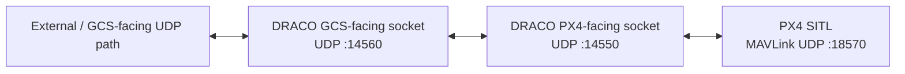

# DRACO — UAV-Side MAVLink Security Gateway

DRACO is an active research prototype built around a C++ UDP gateway between a Ground Control Station path and PX4 SITL.

This public repository intentionally documents **only work that has already been implemented or directly verified**. Detailed future research phases and unpublished design ideas are kept out of the public repository while development is ongoing.

## Current implementation status

The following work has been completed and tested:

- C++ project builds successfully under Ubuntu 24.04 on WSL2;
- minimal `main.cpp` entry point launches the gateway;
- separate `udp_gateway.cpp` contains the network gateway logic;
- GCS-facing IPv4 UDP socket created and bound;
- PX4-facing IPv4 UDP socket created and bound;
- `poll()` used to monitor both sockets in one thread;
- GCS → DRACO → PX4-side forwarding implemented;
- PX4-side → DRACO → remembered GCS endpoint forwarding implemented;
- complete bidirectional UDP round-trip verified with local test endpoints;
- compiled `draco` binary excluded through `.gitignore`;
- PX4-Autopilot SITL installed and built;
- Gazebo X500 simulation launched successfully;
- active PX4 MAVLink UDP instance inspected with `mavlink status`;
- DRACO PX4-facing socket connected to the real PX4 SITL MAVLink path;
- live PX4 UDP traffic received by DRACO;
- MAVLink 2 framing confirmed from live traffic using the `0xFD` magic byte;
- payload length inspected from live MAVLink frames;
- 24-bit MAVLink message IDs reconstructed from the live header;
- MAVLink system ID, component ID, and sequence number inspected.

## Verified current data path



The current PX4 SITL configuration used during testing reported:

```text
mode: Normal
MAVLink version: 2
transport protocol: UDP (18570, remote port: 14550)
```

## Live MAVLink verification

DRACO has received varying live UDP datagram sizes from PX4 and inspected the MAVLink 2 header directly. Examples observed during development include frames where:

```text
first byte     = 0xFD
payload length = extracted from byte 1
system ID      = extracted from byte 5
component ID   = extracted from byte 6
message ID     = reconstructed from bytes 7-9
```

For unsigned MAVLink 2 frames observed during testing, the measured datagram size also matched the expected relationship:

```text
10-byte MAVLink 2 header
+ payload
+ 2-byte checksum
= received frame size
```

## Repository layout

```text
.
├── main.cpp
├── udp_gateway.cpp
├── .gitignore
├── LICENSE
└── docs/
    ├── README.md
    ├── system-architecture.md
    ├── protocol-design.md
    ├── threat-model.md
    ├── development-roadmap.md
    └── CHANGELOG.md
```

## Documentation policy

Public documentation is deliberately limited to completed implementation, confirmed observations, and reproducible current-state notes. Unimplemented research mechanisms, detailed future phases, and unpublished experiment plans are not maintained in this public repository.

## License

MIT License. See [LICENSE](LICENSE).
