# DRACO — Secure Command Authentication for UAV Systems

**Project Status: Architecture & Design Phase**

DRACO is a research-oriented cybersecurity architecture being designed to investigate secure, authenticated command communication between a UAV Ground Control Station (GCS) and UAV firmware. The present repository defines the system design, security boundaries, threat model, protocol concept, and development roadmap. Implementation will be developed incrementally after the architecture and protocol have been reviewed and finalized.

## Architecture at a glance

```mermaid
flowchart LR
    subgraph GROUND["Ground Control System — Trusted Ground Environment"]
        direction TB
        GCS["Ground Control Station"]
        GEN["Command Generation"]
        subgraph GSEC["DRACO Ground Security Layer"]
            direction TB
            SESSION["Session Management"]
            FRESH["Nonce + Timestamp Generation"]
            ENVELOPE["Command Envelope Construction"]
            AUTH["HMAC Authentication"]
            SESSION --> FRESH --> ENVELOPE --> AUTH
        end
        GCS --> GEN --> SESSION
    end

    subgraph CHANNEL["Communication Layer — Untrusted Boundary"]
        PACKET["Authenticated Command Packet"]
        LINK["Authenticated Command Channel"]
        PACKET --> LINK
    end

    subgraph UAV["UAV Side — Protected Command Interface"]
        direction TB
        subgraph GATEWAY["DRACO UAV Security Gateway"]
            direction TB
            PARSE["Packet Parsing"]
            VALIDATE["Session + Freshness + Replay Checks"]
            VERIFY["HMAC Verification"]
            STATE["State-Aware Command Validation"]
            PARSE --> VALIDATE --> VERIFY --> STATE
        end
        FIRMWARE["UAV Firmware / Flight-Control Simulation"]
        DECISION{"Accept or Reject"}
        STATE --> DECISION
        DECISION -->|"Accepted"| FIRMWARE
    end

    subgraph ANALYSIS["Security Analysis Layer"]
        ADV["Adversary / Attack Simulator"]
        LOGGER["Security Event Logger"]
    end

    AUTH --> PACKET
    LINK --> PARSE
    ADV -. "Spoofed, replayed, modified, unauthorized, or state-invalid packets" .-> LINK
    DECISION -->|"Rejected"| LOGGER

    style GROUND fill:#ecfeff,stroke:#0f766e,stroke-width:2px
    style CHANNEL fill:#fff7ed,stroke:#c2410c,stroke-width:2px
    style UAV fill:#eff6ff,stroke:#1d4ed8,stroke-width:2px
    style ANALYSIS fill:#fdf2f8,stroke:#be185d,stroke-width:2px
    style GSEC fill:#f0fdfa,stroke:#0d9488
    style GATEWAY fill:#eff6ff,stroke:#2563eb
```

The intended design places security enforcement on both sides of a potentially hostile communication channel. Ground-side controls construct and authenticate each command envelope; the UAV-side gateway validates the packet before any command can reach the simulated flight-control interface. A future adversary simulator will inject malicious traffic for controlled security experiments, while rejected commands will be recorded by a proposed security event logger.

## Security goals

DRACO is being designed to explore application-layer defenses against:

- replay attacks and stale command reuse;
- command spoofing and unauthorized command injection;
- modification of commands in transit; and
- commands that violate the UAV's current operational state.

The planned architecture combines HMAC-based authentication, session management, nonce and timestamp freshness validation, and state-aware command authorization. These are design goals and intended mechanisms; they have not yet been implemented, tested, validated, or benchmarked.

## Current design

The conceptual command envelope contains a session identifier, command, UAV state, nonce, timestamp, and authentication tag. The initial command set is `ARM`, `DISARM`, `TAKEOFF`, and `LAND`, operating across the proposed `DISARMED`, `ARMED`, and `IN_AIR` states.

The exact serialization, cryptographic parameters, key-management approach, replay-cache behavior, clock policy, and field sizes remain open design decisions.

## Documentation

- [System architecture](docs/system-architecture.md) — components, data flow, security boundaries, and logging design
- [Protocol design](docs/protocol-design.md) — conceptual envelope, intended authentication flow, and UAV state model
- [Threat model](docs/threat-model.md) — threats, assumptions, intended mitigations, and adversary model
- [Development roadmap](docs/development-roadmap.md) — staged path from design to evaluation

## Roadmap summary

1. Review and refine the architecture and protocol.
2. Build the core GCS, channel, UAV, and state-machine simulation.
3. Add session, HMAC, freshness, and replay-protection mechanisms.
4. Develop controlled adversary simulations.
5. Evaluate security behavior and performance trade-offs.

See the [development roadmap](docs/development-roadmap.md) for the complete phase checklist.

## Research scope

DRACO currently focuses on command authentication at the application/security layer. It does not attempt to model every physical, radio-frequency, hardware, avionics, or flight-control threat. The repository contains design documentation only; no operational UAV software or attack tooling is included.

## License

This project is licensed under the [MIT License](LICENSE).
