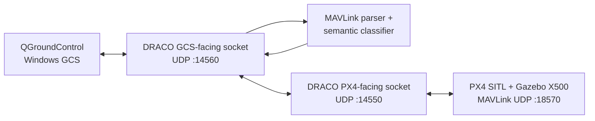

# DRACO — UAV-Side MAVLink Security Gateway

DRACO is an active research prototype built around a C++ UDP gateway placed transparently between QGroundControl and PX4 SITL.

This public repository intentionally documents **only work that has already been implemented or directly verified**. Detailed future research phases and unpublished design ideas are kept out of the public repository while development is ongoing.

## Current Implementation Status

Three implementation milestones have been completed and directly verified:

- Phase 0 — Transport Foundation ✅
- Phase 1 — Transparent QGroundControl ↔ DRACO ↔ PX4 SITL Path ✅
- Phase 2 — MAVLink Parsing and Semantic Classification ✅

DRACO currently provides a transparent bidirectional MAVLink path while also parsing and classifying observed traffic without re-encoding the forwarded frames.

## Verified Data Path



The tested communication path is:

```text
QGroundControl
      ↕
DRACO UDP :14560
      ↕
DRACO UDP :14550
      ↕
PX4 SITL UDP :18570
```

Parsing and classification observe the received MAVLink traffic, while forwarding continues to use the original received byte buffer.

## Phase 0 — Transport Foundation

The following transport work has been implemented and tested:

- C++ project builds successfully under Ubuntu 24.04 on WSL2
- Minimal `main.cpp` entry point launches the gateway
- Separate `udp_gateway.cpp` contains the UDP gateway logic
- GCS-facing IPv4 UDP socket bound to UDP `:14560`
- PX4-facing IPv4 UDP socket bound to UDP `:14550`
- `poll()` monitors both sockets in a single thread
- GCS → DRACO → PX4 forwarding implemented
- PX4 → DRACO → remembered GCS endpoint forwarding implemented
- Bidirectional UDP communication verified

## Phase 1 — Transparent Real-GCS Path

The transparent QGroundControl/PX4 path has been directly verified with PX4 SITL and Gazebo X500:

- PX4-Autopilot SITL installed and built
- Gazebo X500 simulation launched successfully
- active PX4 MAVLink UDP instance inspected using `mavlink status`
- DRACO connected to the real PX4 SITL MAVLink path
- QGroundControl configured as the real Ground Control Station
- genuine QGroundControl MAVLink traffic received by DRACO
- QGroundControl packets forwarded unchanged to PX4 SITL
- PX4 telemetry forwarded through DRACO back to QGroundControl
- QGroundControl successfully discovered the simulated X500 through DRACO
- normal heartbeat and telemetry display verified
- ARM and DISARM commands successfully passed through DRACO
- PX4 `COMMAND_ACK` messages (`msgid 77`) returned through DRACO
- stopping DRACO caused QGroundControl to enter `Comms Lost`
- restarting DRACO restored communication and returned QGroundControl to `Ready`

During testing, the active PX4 MAVLink instance reported:

```text
mode: Normal
MAVLink version: 2
transport protocol: UDP (18570, remote port: 14550)
```

## Phase 2 — MAVLink Parsing and Semantic Classification

Phase 2 replaced manual header inspection with the generated MAVLink library parser and added a separate semantic classification layer.

### MAVLink Parser

The parser is implemented in:

```text
mavlink_parser.h
mavlink_parser.cpp
```

Implemented behavior includes:

- generated MAVLink headers from the PX4 build are used instead of hard-coded message numbers
- incoming bytes are fed through the standard MAVLink parser
- only frames reported as successfully framed are emitted as parsed messages
- parsing is performed for both GCS → PX4 and PX4 → GCS traffic
- each parsed frame carries an explicit direction tag
- parsed metadata includes MAVLink message ID, system ID, component ID, sequence number and payload length
- multiple complete MAVLink frames can be returned from an input buffer
- original received bytes remain separate from parsed representations and are forwarded without re-encoding

Directions are represented as:

```text
GCS_TO_PX4
PX4_TO_GCS
```

### Message Families

The semantic classifier groups recognized traffic into broad message families:

```text
READ_ONLY
COMMAND
PARAMETER
MISSION
POSITION_OR_SETPOINT
MODE_OR_CONTROL
ACK_OR_RESPONSE
STATE_EVIDENCE
OTHER
```

PX4-originated state-evidence classification currently includes messages such as heartbeat, system status, attitude, attitude quaternion, global position, local position and extended system state.

### Semantic Operations

Recognized traffic is further translated into security-relevant semantic operations:

```text
READ_ONLY
ARM
DISARM
TAKEOFF
LAND
RTL
MODE_CHANGE
DIRECT_CONTROL
PARAMETER_WRITE
MISSION_CHANGE
POSITION_TARGET
ACK_OR_RESPONSE
STATE_EVIDENCE
UNKNOWN_WRITE
OTHER
```

`COMMAND_LONG` and `COMMAND_INT` messages are decoded and their `MAV_CMD` values are mapped to semantic operations.

Examples currently handled include:

- `MAV_CMD_COMPONENT_ARM_DISARM` → `ARM` or `DISARM`
- `MAV_CMD_NAV_TAKEOFF` → `TAKEOFF`
- `MAV_CMD_NAV_LAND` → `LAND`
- `MAV_CMD_NAV_RETURN_TO_LAUNCH` → `RTL`
- `MAV_CMD_DO_SET_MODE` → `MODE_CHANGE`
- `MAV_CMD_DO_REPOSITION` → `POSITION_TARGET`
- `MAV_CMD_REQUEST_MESSAGE` → `READ_ONLY`

Known parameter writes, mission-changing messages, position targets, mode changes and direct-control messages are also mapped independently of `COMMAND_LONG`/`COMMAND_INT`.

Unrecognized commands inside command containers are conservatively classified as `UNKNOWN_WRITE`. After recognized harmless and read-only protocol traffic is handled, remaining unclassified GCS-side traffic is also currently labeled `UNKNOWN_WRITE` by the Phase 2 classifier. This is a classification result only; Phase 2 does not yet claim policy enforcement or command blocking.

### Verified Live Classification

ARM and DISARM were exercised through QGroundControl after the parser and classifier were integrated.

Observed output included:

```text
GCS MAVLink: msgid=76 ... family=COMMAND operation=ARM
Library MAVLink: msgid=77 ... family=ACK_OR_RESPONSE operation=ACK_OR_RESPONSE

GCS MAVLink: msgid=76 ... family=COMMAND operation=DISARM
Library MAVLink: msgid=77 ... family=ACK_OR_RESPONSE operation=ACK_OR_RESPONSE
```

This verifies that semantic observation did not break the command/response path.

Normal QGroundControl service traffic was also observed and classified without treating known harmless messages as writes. Examples include:

```text
HEARTBEAT     → OTHER
PING          → OTHER
REQUEST_EVENT → READ_ONLY
```

### Incomplete-Frame Test

A small parser test is kept in:

```text
tests/parser_test.cpp
```

The test supplies an intentionally incomplete MAVLink 2 frame to the parser. The verified result was:

```text
parsed messages: 0
```

This confirms that incomplete input is not promoted into a valid `ParsedMavlinkMessage`.

## Command Path Verification

The final Phase 2 regression test exercised ARM and DISARM through the complete gateway path:

```text
QGroundControl
      ↓
DRACO UDP gateway
      ↓
MAVLink parser
      ↓
semantic classifier
      ↓
original frame forwarded to PX4
      ↓
PX4 COMMAND_ACK
      ↓
DRACO
      ↓
QGroundControl
```

QGroundControl remained connected and PX4 returned `COMMAND_ACK` (`msgid 77`) for both operations.

## Repository Layout

```text
.
├── main.cpp
├── udp_gateway.cpp
├── mavlink_parser.h
├── mavlink_parser.cpp
├── semantic_classifier.h
├── semantic_classifier.cpp
├── tests/
│   └── parser_test.cpp
├── .gitignore
├── LICENSE
├── README.md
└── docs/
    ├── README.md
    ├── system-architecture.md
    ├── protocol-design.md
    ├── threat-model.md
    ├── development-roadmap.md
    └── CHANGELOG.md
```

## Current Development State

DRACO now has a verified transparent real-GCS MAVLink path plus direction-aware protocol parsing and semantic classification.

The current public implementation can:

- receive and forward live MAVLink traffic bidirectionally
- parse valid MAVLink frames using generated MAVLink headers
- preserve the original received frame bytes for forwarding
- distinguish GCS → PX4 from PX4 → GCS traffic
- classify broad MAVLink message families
- decode `COMMAND_LONG` and `COMMAND_INT`
- map recognized commands and write operations into semantic operations
- identify selected PX4-originated state-evidence messages
- conservatively label unclassified GCS-side traffic
- reject incomplete input from the parsed-message output
- preserve the live QGroundControl ↔ PX4 command and telemetry path while classification is active

Further research mechanisms are intentionally not described in the public repository until they have been implemented and experimentally verified.

## Documentation Policy

Public documentation is deliberately limited to completed implementation, verified observations, reproducible current-state behavior and experimentally demonstrated milestones. Unimplemented research mechanisms, future experimental phases and unpublished design details are intentionally kept outside the public repository.

## License

MIT License. See [LICENSE](LICENSE).
