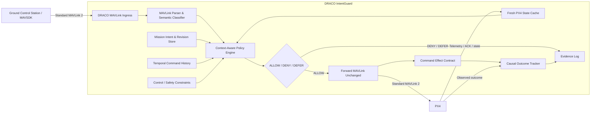
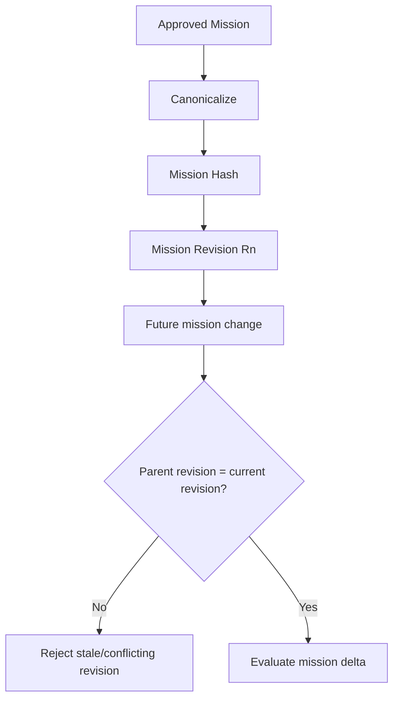
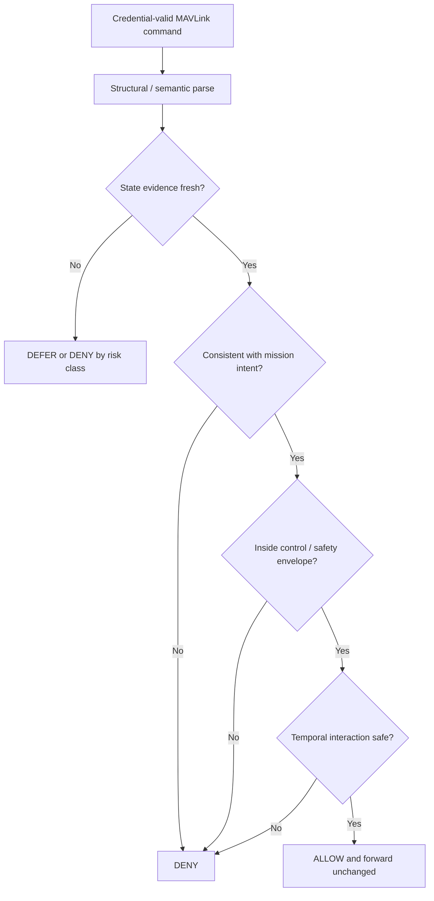
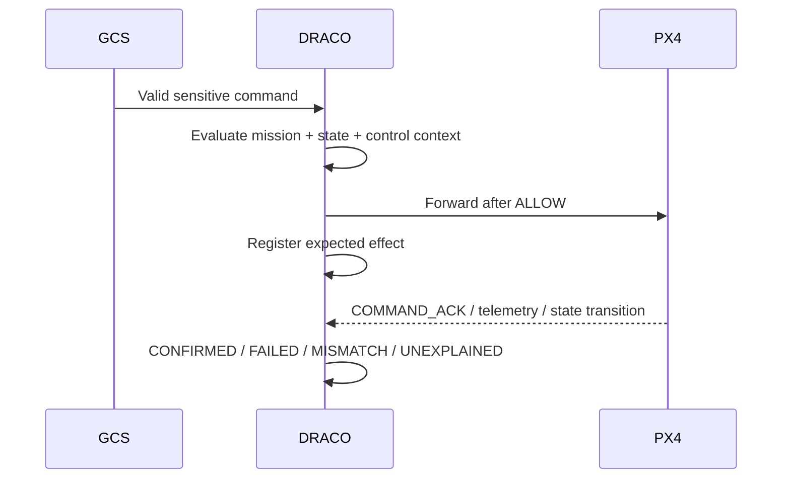

# DRACO — Context-Aware MAVLink Security Gateway

DRACO is a research prototype for **credential-valid, mission-intent- and state-aware authorization of MAVLink commands at the UAV boundary**.

The project is no longer framed as a custom secure MAVLink tunnel or a replacement cryptographic protocol. Existing mechanisms already cover transport protection, message signing, identity, and basic protocol authorization. DRACO instead studies a harder question:

> If a command is syntactically valid and comes from an authenticated or credential-compromised GCS, should that command still be allowed to reach PX4 in the aircraft's current mission and physical context?

## Current implementation status

The repository currently contains a working C++ **bidirectional UDP gateway foundation**:

- GCS-facing UDP socket;
- PX4-facing UDP socket;
- `poll()`-based multiplexing of both directions;
- GCS → DRACO → PX4 forwarding;
- PX4 → DRACO → GCS forwarding;
- return-endpoint tracking for the current GCS test client; and
- a minimal `main.cpp` that launches the gateway.

The gateway has been tested end-to-end with local UDP endpoints. PX4 SITL with Gazebo X500 is also running and is the next integration target.

## Research architecture



DRACO does **not** replace PX4's stabilization, navigator, or failsafe logic. PX4 remains the flight controller. DRACO only mediates whether externally supplied control traffic deserves to reach PX4.

## Core research mechanisms

### 1. Mission Intent Contract

An approved mission is represented as a committed revision with constraints such as operational area, altitude envelope, permitted modes, mission-update policy, and parameter profile. Sensitive commands are evaluated against the active mission revision rather than against a generic allowlist.



### 2. Evidence-aware command authorization

Sensitive operations are evaluated using fresh local evidence.



The initial protected operation families are:

- mission changes;
- parameter writes; and
- external position/setpoint commands.

### 3. Temporal Command Interaction Window

DRACO will not treat every sensitive command as independent. Recent changes are retained so individually legitimate operations can be assessed as a potentially dangerous sequence, especially for controller-, estimator-, failsafe-, or navigation-critical parameters.

### 4. Command Effect Contract

For selected accepted commands, DRACO records the expected PX4-side effect and verifies the later result.



This allows DRACO to ask not only **"was the command permitted?"** but also **"was the later aircraft behavior causally explainable?"**

## Threat model in one sentence

The primary adversary is an **authenticated or credential-valid endpoint that can send well-formed MAVLink commands with unsafe cyber-physical meaning**.

Ordinary unsigned injection, replay, transport confidentiality, and key management remain relevant engineering concerns, but they are not the headline research novelty.

## Near-term development flow

```mermaid
flowchart LR
    A[Bidirectional UDP gateway ✓] --> B[PX4 SITL real MAVLink passthrough]
    B --> C[MAVLink parser / classifier]
    C --> D[Fresh PX4 state cache]
    D --> E[Mission Intent Contract]
    E --> F[ALLOW / DENY / DEFER engine]
    F --> G[Mission + Parameter + Setpoint protections]
    G --> H[Temporal command interactions]
    H --> I[Command Effect Contracts]
    I --> J[Credential-valid attack benchmark]
    J --> K[Security + latency + FPR evaluation]
```



Target: complete the project implementation and experimental harness by **30 September 2026**.

## Repository layout

```text
.
├── main.cpp                 # Minimal program entry point
├── udp_gateway.cpp          # Current bidirectional UDP gateway
├── .gitignore
├── LICENSE
└── docs/
    ├── system-architecture.md
    ├── protocol-design.md
    ├── threat-model.md
    ├── development-roadmap.md
    ├── CHANGELOG.md
    └── README.md
```

## Important scope boundaries

DRACO is not intended to become a flight controller, custom cryptographic protocol, generic machine-learning IDS, or RF/GNSS anti-spoofing system. The first research prototype is focused on the raw MAVLink/PX4 command boundary and on the gap between **valid command syntax/credentials** and **safe mission-context meaning**.

## License

MIT License. See [LICENSE](LICENSE).
