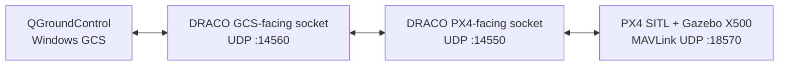

# DRACO — UAV-Side MAVLink Security Gateway

DRACO is an active research prototype built around a C++ UDP gateway placed transparently between QGroundControl and PX4 SITL.

This public repository intentionally documents **only work that has already been implemented or directly verified**. Detailed future research phases and unpublished design ideas are kept out of the public repository while development is ongoing.

## Current Implementation Status

Two implementation milestones have been completed and directly verified:

- Phase 0 — Transport Foundation ✅
- Phase 1 — Transparent QGroundControl ↔ DRACO ↔ PX4 SITL Path ✅

The following work has been completed and tested:

- C++ project builds successfully under Ubuntu 24.04 on WSL2
- Minimal `main.cpp` entry point launches the gateway
- Separate `udp_gateway.cpp` contains the network gateway logic
- GCS-facing IPv4 UDP socket created and bound to UDP `:14560`
- PX4-facing IPv4 UDP socket created and bound to UDP `:14550`
- `poll()` used to monitor both sockets in a single thread
- GCS → DRACO → PX4 forwarding implemented
- PX4 → DRACO → remembered GCS endpoint forwarding implemented
- Bidirectional UDP communication verified
- PX4-Autopilot SITL installed and built
- Gazebo X500 simulation launched successfully
- Active PX4 MAVLink UDP instance inspected using `mavlink status`
- DRACO connected to the real PX4 SITL MAVLink path
- Live PX4 MAVLink traffic received by DRACO
- MAVLink 2 framing confirmed using the `0xFD` magic byte
- MAVLink payload length inspected
- 24-bit MAVLink message IDs reconstructed from the MAVLink 2 header
- MAVLink system ID, component ID, and sequence number inspected
- QGroundControl configured as the real Ground Control Station
- QGroundControl traffic routed through DRACO rather than directly to PX4
- Genuine QGroundControl MAVLink traffic received by DRACO
- QGroundControl packets forwarded unchanged to PX4 SITL
- PX4 telemetry forwarded through DRACO back to QGroundControl
- QGroundControl successfully discovered the simulated X500 through DRACO
- Normal heartbeat and telemetry display verified
- ARM and DISARM commands successfully passed through DRACO
- PX4 `COMMAND_ACK` messages (`msgid 77`) observed for ARM and DISARM
- `COMMAND_ACK` messages successfully forwarded through DRACO back to QGroundControl
- Stopping DRACO caused QGroundControl to enter `Comms Lost`
- Restarting DRACO restored QGroundControl communication and returned it to `Ready`

## Verified Data Path



The tested communication path is:

```text
QGroundControl
      ↕
DRACO UDP :14560
      ↕
DRACO UDP :14550
      ↕
PX4 SITL UDP :18570
```

## PX4 SITL Configuration

During testing, the active PX4 MAVLink instance reported:

```text
mode: Normal
MAVLink version: 2
transport protocol: UDP (18570, remote port: 14550)
```

## MAVLink 2 Inspection

DRACO currently performs basic inspection of live MAVLink 2 headers. The following header fields have been extracted from real PX4 traffic:

```text
Byte 0      → MAVLink magic byte
Byte 1      → Payload length
Byte 4      → Sequence number
Byte 5      → System ID
Byte 6      → Component ID
Bytes 7–9   → 24-bit Message ID
```

MAVLink 2 frames were identified using `0xFD` as the first byte.

The 24-bit MAVLink message ID is reconstructed from the three little-endian header bytes:

```text
message_id = byte[7] | byte[8] << 8 | byte[9] << 16
```

For unsigned MAVLink 2 frames observed during testing, datagram sizes matched:

```text
10-byte MAVLink 2 header
+ payload
+ 2-byte checksum
= frame size
```

## Command Path Verification

A harmless ARM/DISARM test was performed through the complete gateway path.

Observed DRACO output included:

```text
Message ID:77
Command_ack forwarded to GCS
```

for both ARM and DISARM operations. MAVLink message ID `77` corresponds to `COMMAND_ACK`.

The verified command path was therefore:

```text
QGroundControl
      ↓
DRACO
      ↓
PX4
      ↓
COMMAND_ACK
      ↓
DRACO
      ↓
QGroundControl
```

## Gateway Dependency Test

To verify that QGroundControl was not accidentally communicating directly with PX4, DRACO was stopped while QGroundControl and PX4 SITL remained running.

QGroundControl transitioned to:

```text
Comms Lost
```

After DRACO was restarted, QGroundControl recovered and returned to:

```text
Ready
```

This confirms that the tested Ground Control Station communication path depends on DRACO being active.

## Repository Layout

```text
.
├── main.cpp
├── udp_gateway.cpp
├── .gitignore
├── LICENSE
└── docs/
    ├── README.md
    ├── system-architecture.md
    ├── protocol-design.md
    ├── threat-model.md
    ├── development-roadmap.md
    └── CHANGELOG.md
```

## Current Development State

The transport foundation and transparent real-GCS communication path have been completed. DRACO can currently receive MAVLink traffic, forward it to PX4 SITL, receive telemetry and command responses, and return those frames to QGroundControl while remaining transparently in path.

Further research mechanisms are intentionally not described in the public repository until they have been implemented and experimentally verified.

## Documentation Policy

Public documentation is deliberately limited to completed implementation, verified observations, reproducible current-state behavior, and experimentally demonstrated milestones. Unimplemented research mechanisms, future experimental phases, and unpublished design details are intentionally kept outside the public repository.

## License

MIT License. See [LICENSE](LICENSE).
