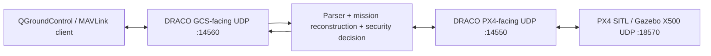

# DRACO — UAV-Side MAVLink Mission-Revision Security Gateway

DRACO is a C++ research prototype that sits between a Ground Control Station (GCS) and PX4 SITL and mediates MAVLink traffic before mission revisions reach the flight controller.

The current implementation has completed the Phase 4 mission-revision security core. DRACO now reconstructs proposed missions, canonicalizes them, compares them against committed mission history, evaluates semantic change and revision causality, checks an independently provisioned mission-intent policy, binds the decision to fresh PX4-derived evidence, and only forwards an authorized mission to PX4 through a separate DRACO→PX4 upload transaction.

This repository documents implemented and directly tested behavior. Full paper-scale evaluation is not yet complete.

## Current Status

Completed and verified milestones:

- Phase 0 — UDP transport foundation ✅
- Phase 1 — transparent QGroundControl ↔ DRACO ↔ PX4 SITL path ✅
- Phase 2 — MAVLink parsing and semantic classification ✅
- Phase 3 — PX4-derived state evidence, freshness and snapshots ✅
- Phase 4 — mission-revision security core, Tasks 1–11 ✅

Phase 4 research semantics are now frozen. Ongoing work on the `evaluation` branch is limited to implementation cleanup, replacement of temporary SITL placeholders, automated benign/adversarial evaluation, baselines, ablations, metrics, result logging and packaging. It must not redefine the frozen security semantics.

## Security Goal

DRACO addresses a gap that packet freshness or protocol-validity checks alone do not solve: a fresh, syntactically valid and potentially credential-valid mission revision can still violate the currently committed mission intent.

The protected mission path is:

```text
GCS mission proposal
        ↓
DRACO buffers/terminates the GCS mission upload
        ↓
mission reconstruction
        ↓
canonical mission
        ↓
semantic delta
        ↓
revision lineage / causality
        ↓
intent contract
        ↓
change budget + authority policy
        ↓
fresh PX4 evidence
        ↓
ALLOW / DENY / DEFER / REQUIRE_HIGHER_AUTHORITY
        ↓
only ALLOW starts a separate DRACO → PX4 mission upload
        ↓
PX4 MISSION_ACK
        ↓
commit revision only after PX4 accepts it
```

A rejected or deferred proposal must not replace the mission already committed in PX4.

## Verified Data Path



Tested topology:

```text
QGroundControl
      ↕
DRACO UDP :14560
      ↕
DRACO UDP :14550
      ↕
PX4 SITL UDP :18570
```

Non-mission traffic continues through the transparent gateway path. Normal mission uploads are intercepted and mediated by DRACO before PX4 sees the proposed mission.

## Phase 2 — MAVLink Parsing and Semantic Classification

The generated MAVLink library parser is used instead of manual packet-header interpretation.

Implemented modules:

```text
mavlink_parser.h/.cpp
semantic_classifier.h/.cpp
```

The parser:

- parses both GCS→PX4 and PX4→GCS traffic
- tags messages with direction
- preserves the original received bytes separately from parsed representations
- supports multiple complete MAVLink frames in an input buffer
- rejects incomplete input from parsed-message output

Semantic message families include:

```text
READ_ONLY
COMMAND
PARAMETER
MISSION
POSITION_OR_SETPOINT
MODE_OR_CONTROL
ACK_OR_RESPONSE
STATE_EVIDENCE
OTHER
```

Security-relevant operations include:

```text
READ_ONLY
ARM
DISARM
TAKEOFF
LAND
RTL
MODE_CHANGE
DIRECT_CONTROL
PARAMETER_WRITE
MISSION_CHANGE
POSITION_TARGET
ACK_OR_RESPONSE
STATE_EVIDENCE
UNKNOWN_WRITE
OTHER
```

## Phase 3 — Trusted PX4 Evidence

Implemented modules:

```text
state_cache.h/.cpp
```

The state cache is updated only from PX4→GCS evidence and stores values together with source and freshness metadata.

Evidence includes:

- armed/disarmed state
- base/custom mode and system status
- landed/airborne state
- global and local position/velocity
- mission state
- control/offboard state
- failsafe state
- system health
- estimator health

Each field tracks:

```text
value
source_sysid
source_compid
observed_at
age
valid
freshness
```

Freshness states are:

```text
FRESH
STALE
INVALID
UNKNOWN
```

The shared usability invariant is:

```text
valid == true && freshness == FRESH
```

`EvidenceSnapshot` freezes a copy of the current PX4-derived evidence for one decision.

## Phase 4 — Mission-Revision Security Core

### Mission Reconstruction and Canonicalization

Implemented modules:

```text
mission_reconstructor.h/.cpp
canonical_mission.h/.cpp
mission_revision.h/.cpp
mission_revision_tracker.h/.cpp
```

DRACO buffers the normal MAVLink mission-upload transaction, reconstructs the complete mission and creates a deterministic canonical representation used for revision hashing and comparison.

Committed revision state tracks:

```text
parent
current
proposed
history
```

A proposed revision is committed only after PX4 returns an accepted `MISSION_ACK`.

### Semantic Mission Delta

Implemented modules:

```text
mission_delta.h/.cpp
```

The semantic delta distinguishes mission evolution beyond simple packet equality. Supported change categories include:

```text
NO_OP
INSERT
DELETE
MOVE_HORIZONTAL
ALTITUDE_CHANGE
COMMAND_CHANGE
PARAMETER_CHANGE
REORDER
DESTINATION_CHANGE
MAJOR_REPLACEMENT
```

The delta summary also records changed-item ratio, maximum horizontal/altitude change, destination change and introduction of critical commands.

### Independent Mission-Intent Contract

Implemented modules:

```text
mission_intent_contract.h/.cpp
```

The contract supports:

- start region
- terminal region
- authorized corridor
- excluded regions
- altitude envelope
- allowed mission commands
- emergency command policy
- authority policy
- in-flight replanning policy
- destination-change authority
- optional validity window

The contract is logically independent of the proposed mission; a proposal does not define its own authorization policy.

### Revision Causality

Implemented modules:

```text
mission_revision_causality.h/.cpp
```

Revision classifications include:

```text
INITIAL_MISSION
NO_OP_REUPLOAD
NORMAL_CHILD
STALE_PARENT
ROLLBACK
CONCURRENT_CONFLICT
UNRELATED_REPLACEMENT
```

Hard causality violations currently include semantic rollback, stale parent and concurrent revision conflict.

### Pre-Forward Authorization

Implemented modules:

```text
mission_authorization.h/.cpp
```

Authorization outcomes are:

```text
ALLOW
DENY
DEFER
REQUIRE_HIGHER_AUTHORITY
```

The authorization gate evaluates revision causality, change budget, intent contract, authority, flight phase and mission content.

Verified live behavior:

```text
ALLOW
  → DRACO starts its own mission upload toward PX4
  → PX4 requests mission items from DRACO
  → DRACO sends the authorized buffered mission
  → PX4 accepts the mission
  → DRACO commits the revision

DENY
  → proposed revision is rejected locally
  → DRACO returns MAV_MISSION_DENIED to the GCS
  → no authorized DRACO→PX4 mission transaction starts
```

### Decision Record and Evidence Binding

Implemented modules:

```text
mission_decision_record.h/.cpp
```

A decision record binds together the proposal, semantic delta, causality classification, authority, PX4 evidence snapshot, evidence usability, flight state, change-budget result and authorization result.

If the required PX4 evidence is unusable, an otherwise `ALLOW` result is converted to `DEFER`.

Policy provenance fields record the mission-intent contract ID/version and change-budget policy ID/version.

### Change Budget

Implemented modules:

```text
mission_change_budget.h/.cpp
```

The change-budget layer can constrain:

- maximum horizontal change
- maximum altitude change
- insertion count
- deletion count
- changed-item ratio
- destination change

`SECURITY_ADMIN` may override the change budget, but that does not override hard causality or hard intent checks. `EMERGENCY_AUTHORITY` is intentionally not a generic budget bypass.

## Phase 4 Test Coverage

Current tests include:

```text
tests/mission_delta_test.cpp
tests/mission_intent_contract_test.cpp
tests/mission_revision_causality_test.cpp
tests/test_mission_authorization.cpp
tests/test_mission_change_budget.cpp
tests/test_phase4_research_freeze.cpp
```

Verified authorization cases include:

- normal child allowed
- rollback denied
- stale parent denied
- concurrent conflict denied
- destination change requires higher authority
- security administrator destination change allowed
- invalid/unprovisioned contract deferred
- change-budget violation requires higher authority
- in-flight replanning policy enforced
- security administrator in-flight replan allowed
- security administrator cannot override rollback

The change-budget unit suite verifies no-op, horizontal/altitude thresholds, insertion/deletion limits, changed-item ratio, destination policy, emergency-authority non-bypass, administrator budget override and delta immutability.

The Task 11 research-freeze test locks the current benign/adversarial populations, baselines, ablations, metrics, mission-size scale points and evaluation handoff boundary.

## Frozen Evaluation Scenarios

Benign population:

```text
BENIGN_NO_OP
BENIGN_SMALL_CORRECTION
BENIGN_INSERT_DELETE
BENIGN_ALTITUDE_CORRECTION
BENIGN_DETOUR
BENIGN_IN_FLIGHT_REPLAN
```

Adversarial population:

```text
ATTACK_SEMANTIC_ROLLBACK
ATTACK_STALE_PARENT
ATTACK_CONCURRENT_CONFLICT
ATTACK_DESTINATION_DIVERSION
ATTACK_COMMAND_SUBSTITUTION
ATTACK_MAJOR_REPLACEMENT
ATTACK_OUTSIDE_INTENT
```

The most important rollback case is a fresh mission transaction containing content from an old superseded revision. It is not a replay of captured MAVLink packets.

## Frozen Baselines and Ablations

Baselines:

```text
BASELINE_A — plain MAVLink
BASELINE_B — MAVLink signing/authenticity only
BASELINE_C — signing + native PX4 feasibility/geofence controls
BASELINE_D — closest stateful-proxy style behavior reproducible in the prototype
BASELINE_E — full DRACO
```

Ablations:

```text
ABLATION_NO_DELTA
ABLATION_NO_INTENT
ABLATION_NO_CAUSALITY
ABLATION_NO_FRESH_EVIDENCE
ABLATION_NO_CHANGE_BUDGET
```

No result should be reported for a baseline or ablation unless it is actually implemented and executed.

## Current Experimental Metrics

The frozen evaluation tracks:

- semantic-delta precision/recall/F1 and alignment accuracy
- malicious proposals blocked / false negatives
- legitimate proposals allowed / false positives
- canonicalization latency
- mission-hash latency
- semantic-delta latency
- policy/authorization latency
- end-to-end decision latency
- p50 / p95 / p99 latency
- mission-size scaling
- rollback detection success
- stale-parent detection success
- conflict detection success
- PX4 unchanged-after-denial invariant

Frozen mission-size points:

```text
10
50
100
500
1000
```

## Known Prototype Limitations / Temporary Configuration

The Phase 4 research semantics are complete, but the current live gateway still contains development placeholders that are intentionally being replaced during the evaluation/cleanup stage:

- the live SITL mission-intent contract is currently hard-coded in `udp_gateway.cpp`
- the live proposer identifier is currently `"unbound-gcs"`
- the live authority is currently hard-coded to `NORMAL_OPERATOR`
- current change-budget thresholds are experimental policy values, not universal safety constants
- SYSID/COMPID/IP/UDP endpoint are not treated as cryptographically authenticated GCS identity
- mission interception is currently datagram-level; a future engineering cleanup must preserve behavior correctly if mission and non-mission frames share one datagram

These items are implementation/provisioning cleanup tasks. They are not permission to redefine the frozen mission-delta, causality, intent, authorization or threat-model semantics.

## Build

Environment used during development:

```text
Windows 11
WSL2
Ubuntu 24.04 LTS
g++ 13.x
PX4 SITL
Gazebo X500
QGroundControl
```

PX4 SITL:

```bash
cd ~/PX4-Autopilot
make px4_sitl gz_x500
```

DRACO:

```bash
g++ main.cpp \
udp_gateway.cpp \
mavlink_parser.cpp \
semantic_classifier.cpp \
state_cache.cpp \
mission_reconstructor.cpp \
canonical_mission.cpp \
mission_revision.cpp \
mission_revision_tracker.cpp \
mission_delta.cpp \
mission_intent_contract.cpp \
mission_revision_causality.cpp \
mission_authorization.cpp \
mission_decision_record.cpp \
mission_change_budget.cpp \
-I"$HOME/PX4-Autopilot/build/px4_sitl_default/mavlink" \
-o draco \
-lcrypto
```

## Repository Layout

```text
.
├── main.cpp
├── udp_gateway.cpp
├── mavlink_parser.h/.cpp
├── semantic_classifier.h/.cpp
├── state_cache.h/.cpp
├── mission_reconstructor.h/.cpp
├── canonical_mission.h/.cpp
├── mission_revision.h/.cpp
├── mission_revision_tracker.h/.cpp
├── mission_delta.h/.cpp
├── mission_intent_contract.h/.cpp
├── mission_revision_causality.h/.cpp
├── mission_authorization.h/.cpp
├── mission_decision_record.h/.cpp
├── mission_change_budget.h/.cpp
├── phase4_research_freeze.h/.cpp
├── tests/
├── docs/
├── .gitignore
├── LICENSE
└── README.md
```

## Branches

`main` is the clean Phase 4 research-core checkpoint.

`evaluation` is reserved for post-freeze engineering cleanup and controlled local PX4-SITL evaluation. Changes on that branch should not alter the frozen security semantics unless a concrete bug is identified and reviewed first.

## Safety Scope

The adversarial evaluation is intended only for systems owned and controlled by this project, specifically localhost DRACO and PX4 SITL. The repository does not authorize testing against real aircraft, external UAVs or third-party systems.

## Documentation Policy

Public documentation is limited to implemented behavior, verified tests, frozen experiment definitions and clearly identified prototype limitations. Unexecuted evaluation results must not be presented as measured results.

## License

MIT License. See [LICENSE](LICENSE).
