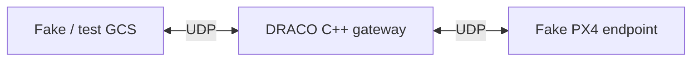
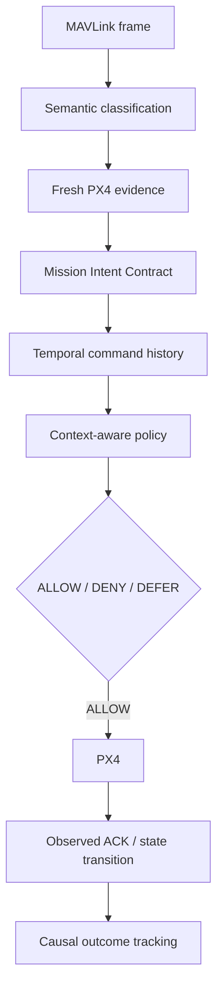

# DRACO Documentation Index

This directory contains the current design and execution documents for **DRACO IntentGuard**, a context-aware MAVLink security gateway for PX4.

The project has moved beyond its earlier custom HMAC-envelope concept. The current research direction is to mediate **credential-valid, well-formed MAVLink commands** using committed mission intent, fresh PX4 state, control/safety constraints, temporal command interactions, and command-to-outcome provenance.

## Documents

- [System architecture](system-architecture.md) — current gateway foundation, target IntentGuard architecture, trust boundaries, state cache, mission intent, temporal history, and causal outcome tracking.
- [MAVLink mediation design](protocol-design.md) — raw MAVLink processing pipeline, semantic operation model, evidence snapshots, Mission Intent Contract, verdicts, and Command Effect Contracts.
- [Threat model](threat-model.md) — credential-valid attacker model, evidence assumptions, attack classes, and residual risks.
- [Development roadmap](development-roadmap.md) — implementation plan through the 30 September 2026 project freeze.
- [Changelog](CHANGELOG.md) — major changes in project direction and implementation status.

## Current implementation snapshot



Completed in code:

- bidirectional UDP forwarding;
- separate GCS- and PX4-facing sockets;
- `poll()`-based multiplexing;
- return-path tracking for the current GCS test client; and
- end-to-end local round-trip testing.

PX4 SITL with Gazebo X500 has also been launched successfully. The next implementation step is real PX4 MAVLink passthrough through DRACO.

## Target research flow



## Research focus

The first complete implementation prioritizes:

```text
MISSION_CHANGE
PARAMETER_WRITE
POSITION_TARGET
```

The key research question is whether a transparent raw-MAVLink gateway can prevent credential-valid cyber-physical misuse without becoming the flight controller or requiring a replacement GCS protocol.
