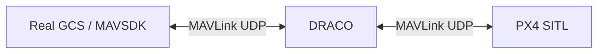
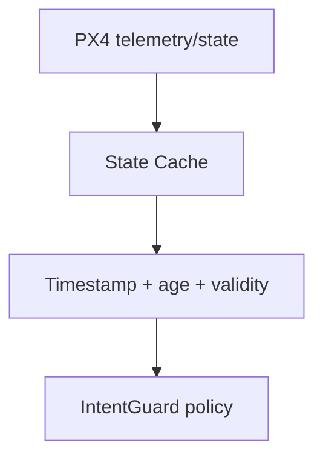
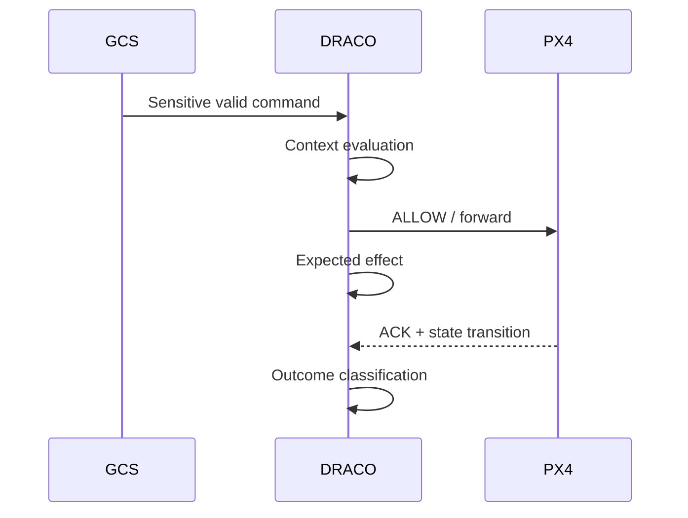

# DRACO Development Roadmap

**Hard project-completion target: 30 September 2026**

This roadmap reflects the current IntentGuard direction and the implementation that already exists. The bidirectional UDP gateway is complete; the next work is real PX4 MAVLink integration, semantic parsing, trusted state, mission intent, context-aware policy, causal outcome tracking, and a credential-valid attack benchmark.

## Completed foundation

- [x] WSL2 / Ubuntu development environment.
- [x] GCC/G++ build flow.
- [x] Split minimal `main.cpp` from networking implementation.
- [x] GCS-facing UDP socket.
- [x] PX4-facing UDP socket.
- [x] `poll()`-based bidirectional I/O.
- [x] GCS → DRACO → PX4 forwarding with local test endpoint.
- [x] PX4 → DRACO → GCS return forwarding.
- [x] End-to-end local round-trip test.
- [x] PX4-Autopilot cloned with submodules.
- [x] PX4 SITL + Gazebo X500 launched successfully.
- [x] PX4 MAVLink instances inspected with `mavlink status`.

## Phase 1 — Real PX4 MAVLink path

**Target: 28 August**

- [ ] Route PX4 SITL GCS-facing MAVLink traffic through DRACO.
- [ ] Verify PX4 ↔ DRACO ↔ GCS bidirectional traffic.
- [ ] Capture and inspect real MAVLink 2 frames.
- [ ] Remove obsolete local fake-PX4 assumptions from the gateway.
- [ ] Add safe malformed/size handling around real traffic.



**Exit criterion:** PX4 SITL can communicate normally through DRACO with the gateway in pass-through mode.

## Phase 2 — MAVLink parser and semantic classifier

**Target: 31 August**

- [ ] Parse MAVLink 2 framing safely.
- [ ] Extract message IDs and command payloads needed by the first prototype.
- [ ] Classify operations into internal semantic types.
- [ ] Preserve original raw frames for forwarding.
- [ ] Default-deny or explicitly handle unknown sensitive writes once enforcement is enabled.

Initial operation classes:

```text
MISSION_CHANGE
PARAMETER_WRITE
POSITION_TARGET
MODE_CHANGE
COMMAND
READ_ONLY
UNKNOWN_WRITE
```

## Phase 3 — Fresh PX4 state cache

**Target: 4 September**

- [ ] Track armed/disarmed state.
- [ ] Track navigation/flight mode.
- [ ] Track landed/airborne state.
- [ ] Track position/velocity used by mission/setpoint checks.
- [ ] Track failsafe / estimator validity where available.
- [ ] Timestamp every state update.
- [ ] Expose state age and validity to the policy engine.



## Phase 4 — Mission Intent Contract

**Target: 8 September**

- [ ] Define canonical mission representation for experiments.
- [ ] Compute mission hash/revision.
- [ ] Track parent revision.
- [ ] Define operational area/corridor.
- [ ] Define altitude envelope.
- [ ] Define permitted mission-change policy.
- [ ] Compute meaningful mission deltas.
- [ ] Detect stale/conflicting mission revisions.

## Phase 5 — ALLOW / DENY / DEFER policy engine

**Target: 12 September**

- [ ] Define deterministic policy interface.
- [ ] Build coherent evidence snapshots.
- [ ] Add stable reason codes.
- [ ] Support three-valued decisions: `ALLOW`, `DENY`, `DEFER`.
- [ ] Ensure stale/missing evidence cannot silently become ALLOW.
- [ ] Keep critical-path evaluation bounded and deterministic.

## Phase 6 — Three core IntentGuard protections

**Target: 18 September**

### Mission changes

- [ ] Validate revision parentage.
- [ ] Compare mission delta with committed intent.
- [ ] Enforce operational-area / altitude constraints.
- [ ] Distinguish approved re-plan from unauthorized replacement.

### Parameter writes

- [ ] Build parameter-risk categories.
- [ ] Apply armed/state restrictions by category.
- [ ] Add rate constraints.
- [ ] Track coupled sensitive parameter changes.

### Position / setpoint commands

- [ ] Check target against operational area/corridor.
- [ ] Check mode/context requirements.
- [ ] Check evidence freshness.
- [ ] Add lightweight trajectory-intent logic.

## Phase 7 — Temporal Command Interaction Window

**Target: 20 September**

- [ ] Store bounded recent sensitive-command history.
- [ ] Track values, category, timestamp, and source metadata.
- [ ] Define coupled-risk predicates.
- [ ] Test individually legal but collectively unsafe sequences.

## Phase 8 — Command Effect Contracts and causal tracking

**Target: 24 September**

- [ ] Register expected consequences for selected ALLOW decisions.
- [ ] Correlate PX4 ACKs with decisions.
- [ ] Correlate later PX4 state transitions.
- [ ] Produce `CONFIRMED`, `FAILED`, `MISMATCH`, `UNEXPLAINED` outcomes.
- [ ] Recognize ordinary mission progression and known failsafe/internal causes to reduce false alarms.



## Phase 9 — DRACO-SemBench attack harness

**Target: 27 September**

Credential-valid / authorized attack scenarios:

- [ ] unapproved in-flight mission replacement;
- [ ] stale-parent mission revision;
- [ ] flight-critical parameter mutation;
- [ ] coupled parameter manipulation;
- [ ] setpoint outside mission corridor;
- [ ] command-rate manipulation;
- [ ] stale evidence;
- [ ] conflicting GCS mission revisions where practical;
- [ ] baseline replay/injection comparison.

Benign scenarios:

- [ ] normal mission upload;
- [ ] takeoff / normal mission progression;
- [ ] hold / RTL / land;
- [ ] approved mission re-plan;
- [ ] legitimate disarmed parameter maintenance;
- [ ] communication delay / stale telemetry conditions;
- [ ] expected failsafe-driven transitions.

## Phase 10 — Evaluation and project freeze

**Target: 30 September**

Compare at least:

```text
PX4 baseline
PX4 + existing communication security where configured
DRACO pass-through / static policy baseline
DRACO full IntentGuard
```

Measure:

- [ ] attack prevention/detection rate by family;
- [ ] false-positive rate on benign operations;
- [ ] precision/recall/F1 where meaningful;
- [ ] p50/p95/p99 decision latency;
- [ ] end-to-end added latency/jitter;
- [ ] CPU usage;
- [ ] resident memory;
- [ ] packet drops attributable to DRACO;
- [ ] mission completion/impact;
- [ ] causal-attribution accuracy for outcome tracking.

## Non-goals before the September freeze

Do not divert development time into:

- custom encryption / AEAD;
- custom PKI;
- blockchain;
- neural-network authorization;
- swarm coordination;
- RF/GNSS anti-spoofing;
- full MAVLink dialect coverage;
- production certification.

These may be future work only if they directly support a later research question.
