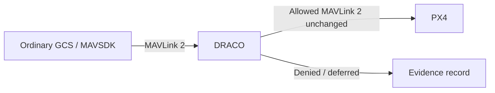
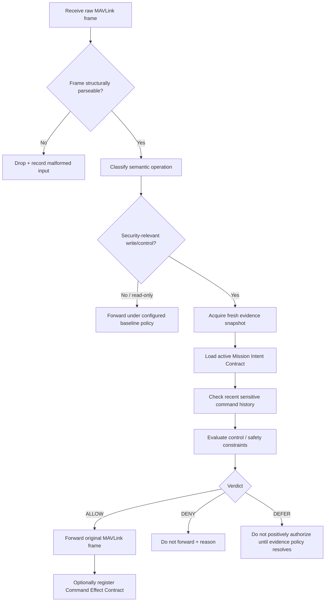
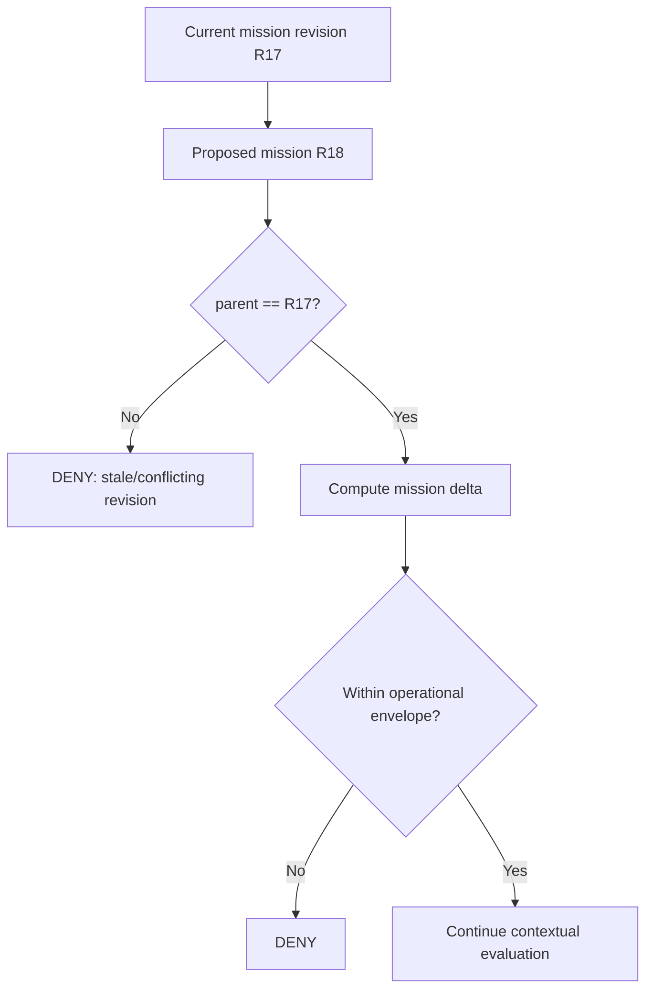
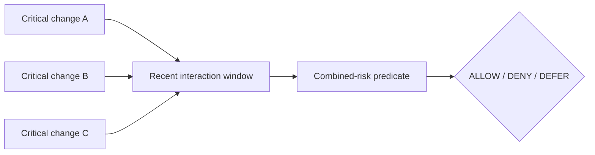

# DRACO MAVLink Mediation Design

**Status:** Supersedes the earlier custom HMAC command-envelope concept.

DRACO will preserve **standard MAVLink 2** between the GCS/API side and PX4. The research contribution is not a replacement wire protocol. Existing signing, VPN, or other mature transport security can be used independently.

## Wire-level rule



This gives DRACO backwards compatibility with ordinary MAVLink tooling while inserting policy at an enforced gateway.

## Processing pipeline

For each incoming frame:



## Semantic operation model

The parser should map many concrete MAVLink messages/commands into a smaller internal semantic vocabulary.

Initial classes:

```text
MISSION_CHANGE
PARAMETER_WRITE
POSITION_TARGET
MODE_CHANGE
COMMAND
MANUAL_CONTROL
OFFBOARD_CONTROL
READ_ONLY
UNKNOWN_WRITE
```

The first paper implementation should prioritize only three high-value families:

1. `MISSION_CHANGE`
2. `PARAMETER_WRITE`
3. `POSITION_TARGET`

## Command event

An internal event may contain fields conceptually equivalent to:

```cpp
struct CommandEvent {
    uint64_t decision_id;
    uint64_t rx_monotonic_ns;
    uint32_t mavlink_msg_id;
    SemanticOperation operation;
    SourceMetadata source;
    RawFrameView raw_frame;
};
```

This is an internal representation only. It does not alter MAVLink on the wire.

## Evidence snapshot

Every sensitive decision should evaluate a coherent state snapshot rather than reading unrelated variables at arbitrary times.

Conceptually:

```cpp
struct EvidenceSnapshot {
    uint64_t captured_ns;
    VehicleState vehicle;
    NavigationState navigation;
    MissionRevision mission;
    EstimatorState estimator;
    FailsafeState failsafe;
};
```

Each field requires freshness/validity metadata.

## Mission Intent Contract

A mission contract records what is committed and what kinds of changes remain acceptable.

Example development representation:

```yaml
mission:
  revision: R17
  parent: R16
  operational_area: inspection_zone_a
  altitude_m:
    min: 25
    max: 80
  permitted_modes:
    - AUTO_MISSION
    - HOLD
    - RTL
    - LAND
  in_flight_mission_update: constrained
  parameter_profile: flight_profile_A
```

Thresholds above are examples only; vehicle/mission-specific values must come from the experiment configuration.

## Mission revision logic



The mission delta can include waypoint additions/removals, maximum displacement, altitude changes, command-type changes, and corridor/geofence effects.

## Parameter risk model

`PARAMETER_WRITE` should not be evaluated as a single undifferentiated operation.

Initial risk categories:

```text
LOW_RISK
GROUND_ONLY
NAVIGATION_CRITICAL
ESTIMATOR_CRITICAL
CONTROLLER_CRITICAL
FAILSAFE_CRITICAL
SECURITY_CRITICAL
```

Policy can then use state and category together instead of hard-coding every parameter into one rule.

## Temporal interaction window

DRACO should retain recent sensitive operations in a bounded history structure.



The purpose is to catch unsafe interactions caused by values, timing, rate, or coupled changes even when individual frames are legal.

## Setpoint / trajectory intent

For external position targets, DRACO should compare the requested target against:

- the active mission corridor or operational area;
- altitude envelope;
- current position/velocity;
- current navigation mode;
- allowed external-control policy; and
- evidence freshness.

The first model should stay deterministic and lightweight. A bounded geometric or simple short-horizon projection is preferable to ML on the authorization path.

## Verdict model

```cpp
enum class Verdict {
    Allow,
    Deny,
    Defer
};
```

Suggested reason families:

```text
MALFORMED_MAVLINK
STALE_EVIDENCE
MISSION_REVISION_CONFLICT
MISSION_INTENT_VIOLATION
PARAMETER_STATE_VIOLATION
PARAMETER_INTERACTION_RISK
TARGET_OUTSIDE_MISSION_ENVELOPE
MODE_CONTEXT_VIOLATION
RATE_LIMIT_VIOLATION
UNKNOWN_SENSITIVE_OPERATION
```

Exact names will evolve with implementation.

## Command Effect Contract

For selected allowed operations, DRACO creates an expectation tied to the decision.

Example:

```text
Decision D9182
operation: MODE_CHANGE
verdict: ALLOW
expected effect: nav_state = AUTO_RTL
validity window: T
```

Later PX4 ACK/state evidence closes the contract as:

```text
CONFIRMED
FAILED
MISMATCH
UNEXPLAINED
```

This mechanism supports command-to-outcome provenance without making DRACO responsible for flight control.

## What is explicitly not being designed here

- a custom MAVLink replacement;
- a new AEAD scheme;
- a new PKI;
- a second flight controller;
- a neural-network command gate; or
- a claim that authentication alone identifies operator intent.
