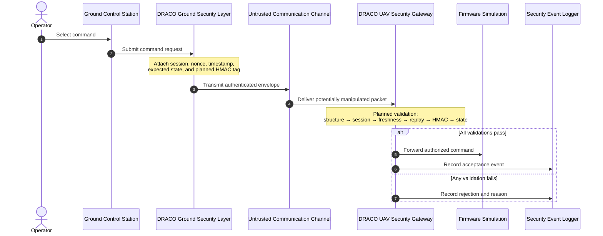
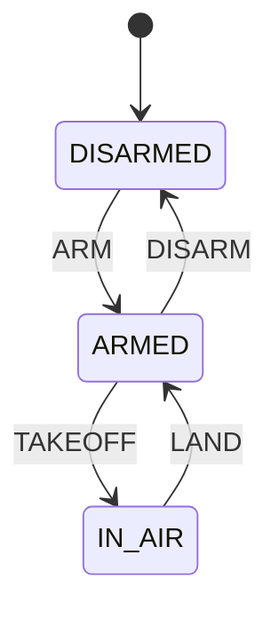

# DRACO Protocol Design

**Status: Conceptual protocol — not implemented**

This document describes the planned command-authentication protocol at a design level. It intentionally leaves serialization, field sizes, cryptographic parameters, key management, and transport framing open until the architecture has been reviewed.

## Conceptual command envelope

```text
DRACO Command Envelope

+--------------------+
| Session ID         |
+--------------------+
| Command            |
+--------------------+
| UAV State          |
+--------------------+
| Nonce              |
+--------------------+
| Timestamp          |
+--------------------+
| Authentication Tag |
+--------------------+
```

The future authentication tag is expected to cover the security-relevant envelope fields using an unambiguous canonical representation. The exact serialization format and field sizes will be finalized during implementation design.

## Field intent

| Field | Intended purpose | Open considerations |
| --- | --- | --- |
| Session ID | Identifies the currently authorized communication session. | Identifier generation, lifetime, binding to key material, and reuse policy. |
| Command | Represents the requested UAV operation. The initial planned set is `ARM`, `DISARM`, `TAKEOFF`, and `LAND`. | Numeric/string encoding, extensibility, and unknown-command behavior. |
| UAV State | Binds the request to the state in which the GCS expects the command to be evaluated. The initial planned states are `DISARMED`, `ARMED`, and `IN_AIR`. | Handling a stale client view and defining which state value is authenticated. |
| Nonce | Provides a per-command freshness value intended to prevent reuse of a previously accepted packet. | Size, generation method, uniqueness scope, cache retention, and crash recovery. |
| Timestamp | Supports freshness-window validation and limits how long a captured packet may remain eligible. | Clock source, representation, allowable skew, and synchronization failures. |
| Authentication Tag | Planned HMAC output used to authenticate the envelope and detect modification. | Algorithm selection, tag length, canonical input, comparison behavior, and key lifecycle. |

An envelope version or algorithm identifier may be needed in a later revision, but no additional field is fixed by this initial concept.

## Intended authentication flow

The following sequence is planned, not implemented behavior:

1. A valid communication session exists between the Ground Control Station and UAV.
2. The Ground Control Station generates a command.
3. DRACO attaches the active session identifier.
4. A fresh nonce is generated.
5. A timestamp is added.
6. The command envelope is constructed.
7. An HMAC authentication tag is generated.
8. The authenticated packet is transmitted.
9. The UAV security gateway receives the packet.
10. The packet structure is validated.
11. The session is validated.
12. Timestamp freshness is checked.
13. The nonce is checked for replay.
14. The HMAC is verified.
15. The requested command is checked against the UAV's current state.
16. Valid commands are forwarded to the simulated firmware.
17. Invalid commands are rejected.
18. Relevant security events are logged.



## Proposed UAV state model

The initial state machine is intentionally small so that authentication and authorization decisions remain observable during early experiments.



| Current state | Command | Intended next state | Planned decision |
| --- | --- | --- | --- |
| `DISARMED` | `ARM` | `ARMED` | Allow after security validation |
| `ARMED` | `DISARM` | `DISARMED` | Allow after security validation |
| `ARMED` | `TAKEOFF` | `IN_AIR` | Allow after security validation |
| `IN_AIR` | `LAND` | `ARMED` | Allow after security validation |

Any command not defined for the current state should eventually be rejected by the state-validation component with a proposed `INVALID_STATE_TRANSITION` event. This policy is a design target and has not yet been implemented or tested.

## Freshness and replay concept

Nonce and timestamp checks serve related but distinct purposes in the proposed design:

- the nonce is intended to identify a command envelope that has already been accepted or observed within a session; and
- the timestamp is intended to bound packet age and the amount of replay history that must be retained.

The implementation design will need to specify when nonces enter the replay cache, how long they remain there, how cache state survives restarts, and how clock disagreement is handled. A timestamp alone is not assumed to prevent replay, and a nonce alone does not establish when a packet was created.

## Authentication concept

HMAC is the planned primitive for authenticating canonical command-envelope bytes with session-associated secret key material. Future design work must select an approved hash function, tag length, key derivation approach, and constant-time verification method. It must also ensure that every security-relevant field—and any protocol version or domain separator—is included in the authenticated representation.

HMAC is intended to provide authenticity and integrity for parties that share the appropriate secret. It does not by itself provide confidentiality, non-repudiation, secure key distribution, or protection for a compromised endpoint.

## Protocol decisions still open

- binary, text, or structured serialization format;
- canonical field ordering and encoding rules;
- protocol versioning and algorithm agility;
- session negotiation and mutual authentication;
- key derivation and separation between sessions;
- nonce generation and replay-cache semantics;
- timestamp precision, epoch, freshness window, and clock policy;
- packet-size limits and malformed-input handling; and
- response, acknowledgement, retransmission, and error-message behavior.
