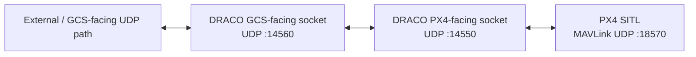

# DRACO System Architecture — Verified Current State

This public document describes only the architecture that has already been implemented and directly tested.

## Current data path



## Implemented components

### Program entry point

`main.cpp` currently provides the minimal executable entry point and launches the gateway.

### GCS-facing UDP endpoint

DRACO creates an IPv4 UDP socket, binds it to the GCS-facing local port, receives datagrams, records the sender endpoint, and forwards received data toward the PX4-facing side.

### PX4-facing UDP endpoint

DRACO creates a second IPv4 UDP socket for the PX4-facing path. It receives live PX4 SITL traffic and can forward replies back toward the remembered GCS endpoint.

### Event multiplexing

Both sockets are monitored using `poll()` in a single thread. Each ready socket is handled in its own branch.

### PX4 SITL integration

The active PX4 SITL MAVLink instance used during testing reported:

```text
mode: Normal
MAVLink version: 2
transport protocol: UDP (18570, remote port: 14550)
```

DRACO has been configured accordingly and continuously receives live PX4 traffic.

## Verified behaviour

- bidirectional UDP forwarding works with local test endpoints;
- PX4 SITL and Gazebo X500 run successfully;
- DRACO receives real PX4 MAVLink 2 traffic;
- MAVLink 2 framing has been confirmed from live packets;
- selected MAVLink header fields have been inspected successfully.

## Public scope

Detailed future architecture, unpublished enforcement mechanisms, and experiment designs are intentionally omitted from the public repository until implemented and validated.
