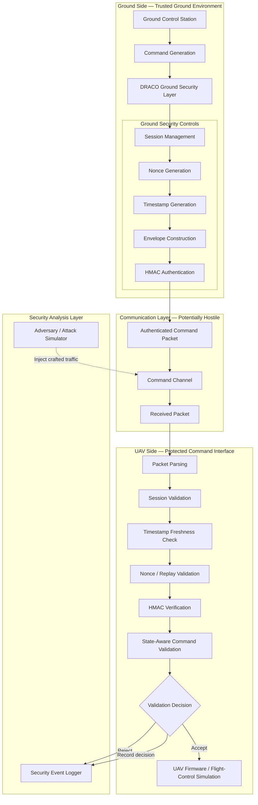
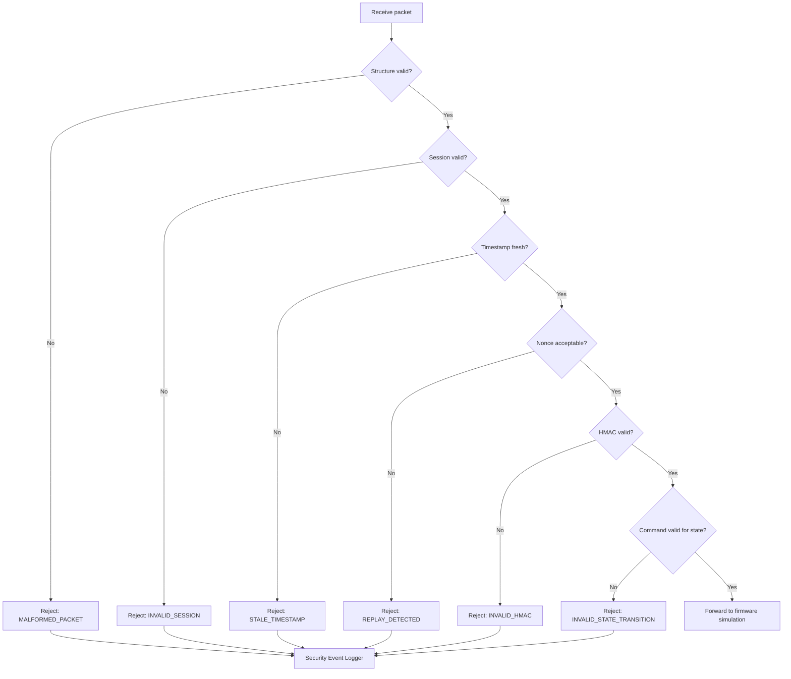

# DRACO System Architecture

**Status: Proposed architecture — not implemented**

This document defines the intended architecture for DRACO, a research system for studying authenticated UAV command communication. It describes the responsibilities and security boundaries that will guide a future implementation; it does not describe deployed or validated behavior.

## Design objectives

The architecture is intended to:

- ensure that only commands associated with an authorized session are considered;
- authenticate command contents and detect modification;
- reject replayed or stale command envelopes;
- prevent commands from bypassing the UAV's state-transition policy;
- keep security enforcement separate from the simulated flight-control logic; and
- produce structured evidence for future security experiments.

## Intended end-to-end architecture



## Component responsibilities

### Ground Control Station

The future GCS simulator will originate operator-selected UAV commands. It should express intent only; security metadata and cryptographic processing will be delegated to the DRACO Ground Security Layer.

### Command Generation

This component will convert an operator action into a normalized command request. The initial planned command vocabulary is `ARM`, `DISARM`, `TAKEOFF`, and `LAND`. Input validation and command encoding rules will be finalized with the protocol format.

### DRACO Ground Security Layer

The ground security layer is intended to transform a command request into an authenticated command envelope. Its planned responsibilities are:

- maintaining or selecting the active authorized session;
- generating a nonce that is fresh within that session;
- adding a timestamp under the selected clock and freshness policy;
- serializing security-relevant fields in an unambiguous order; and
- generating an HMAC authentication tag over the canonical envelope contents.

Key establishment, storage, rotation, and session-lifecycle details remain design decisions. No assumption is made here that a future implementation will be secure merely by using HMAC; correct key handling and canonical serialization will also be required.

### Authenticated Command Channel

The channel represents the transport path between the GCS and UAV. For security analysis it is considered potentially hostile: packets may be observed, delayed, dropped, duplicated, reordered, modified, or injected. The architecture does not depend on the channel itself providing authentication.

The word “authenticated” describes the intended envelope carried over the channel, not a claim that the transport has already been secured.

### DRACO UAV Security Gateway

The gateway is intended to be the only path by which external command packets reach the simulated UAV firmware. It will apply validation in a defined order:

1. parse the packet and reject malformed structures;
2. validate the referenced session;
3. evaluate timestamp freshness;
4. check the nonce against the replay policy;
5. verify the HMAC authentication tag; and
6. authorize the command for the UAV's current state.

Only a command that passes every required stage should be forwarded. Exact ordering may be refined to balance denial-of-service resistance, information exposure, and implementation simplicity.

### UAV Firmware / Flight-Control Simulation

The future firmware simulator will model the small state machine needed for DRACO experiments. It is intentionally separated from the security gateway so experiments can distinguish security validation from command execution and state changes. It is not intended to control a real aircraft.

### Adversary / Attack Simulator

The future adversary simulator will inject controlled packets into the communication channel. Planned experiments include spoofed commands, replayed valid packets, modified packets, packets associated with unauthorized sessions, and commands that are invalid for the current UAV state. No attack code is included in this design-phase repository.

### Security Event Logger

The proposed logger will capture security-relevant decisions without becoming part of the authorization decision itself. Future event records may include:

- timestamp;
- session identifier;
- requested command;
- current UAV state;
- validation stage;
- accept or reject decision; and
- rejection reason.

Proposed rejection reason identifiers are:

```text
INVALID_SESSION
STALE_TIMESTAMP
REPLAY_DETECTED
INVALID_HMAC
INVALID_STATE_TRANSITION
MALFORMED_PACKET
```

These identifiers and the event schema are provisional. Logging will need to avoid exposing secret keys, full authentication material, or other sensitive data.

## Trust boundaries

```mermaid
flowchart LR
    TRUSTED["Trusted Ground Environment"]
    CHANNEL["Potentially Hostile Communication Channel"]
    GATEWAY["Protected UAV Command Interface"]
    FIRMWARE["UAV Firmware Simulation"]

    TRUSTED -->|"Trust Boundary 1: authenticated envelope leaves ground side"| CHANNEL
    CHANNEL -->|"Trust Boundary 2: all inbound data is untrusted"| GATEWAY
    GATEWAY -->|"Only fully validated commands"| FIRMWARE

    style TRUSTED fill:#ecfeff,stroke:#0f766e,stroke-width:2px
    style CHANNEL fill:#fff7ed,stroke:#c2410c,stroke-width:2px
    style GATEWAY fill:#eff6ff,stroke:#1d4ed8,stroke-width:2px
    style FIRMWARE fill:#f0fdf4,stroke:#15803d,stroke-width:2px
```



### Boundary 1: ground environment to communication channel

The ground environment is assumed to protect its session and key material for the initial research model. Once a packet enters the channel, its confidentiality, integrity, ordering, and delivery are not trusted unless provided by an explicitly modeled mechanism.

### Boundary 2: communication channel to UAV gateway

Every received byte is treated as attacker-controlled until validated. The gateway must not forward a command, mutate UAV state, or mark a nonce as accepted based solely on partially validated input. The precise point at which replay state is committed will be specified during implementation design.

### Boundary 3: gateway to simulated firmware

The gateway-to-firmware interface carries commands that have passed the planned security checks. The firmware simulation remains responsible for safe state changes, while the gateway enforces the command authorization policy using the current state.

## Planned decision flow



This is the planned validation sequence. It may change after protocol review and threat analysis; it is not implemented behavior.

## Open architecture decisions

- session establishment, expiration, renewal, and teardown;
- key provisioning, derivation, rotation, and secure storage;
- canonical serialization and version negotiation;
- nonce uniqueness strategy and replay-cache lifetime;
- timestamp source, allowable clock skew, and resynchronization;
- error-reporting granularity and resistance to validation oracles;
- persistence and integrity requirements for security logs; and
- interfaces between the gateway, state model, and firmware simulation.
