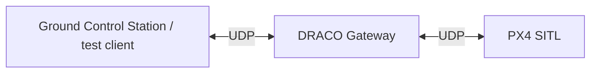
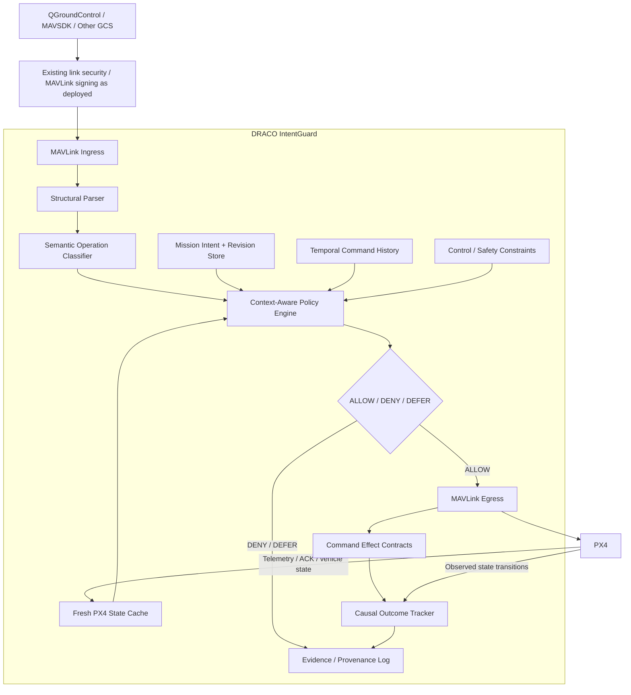
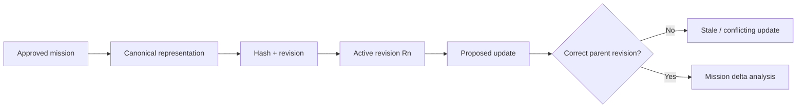
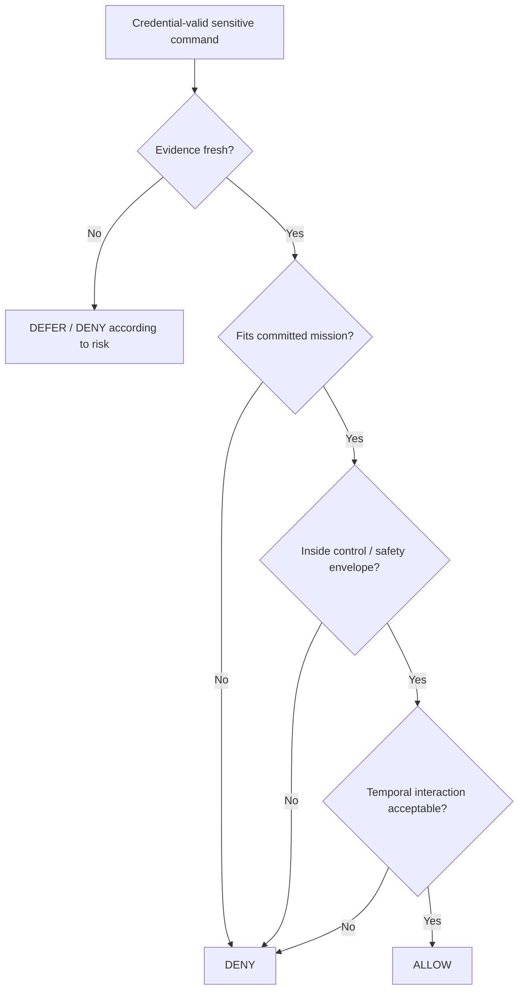
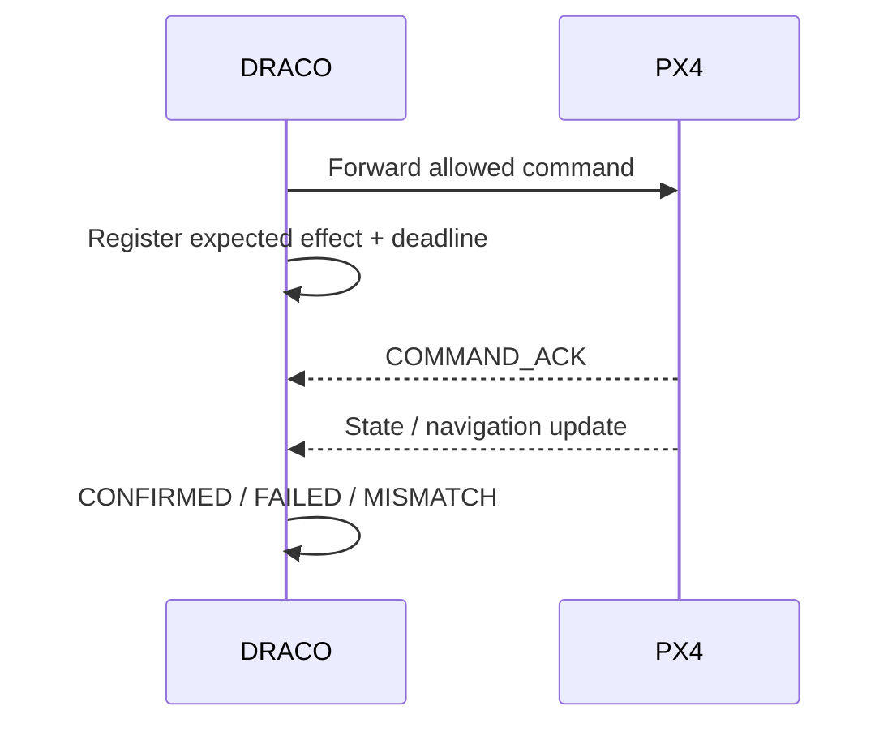
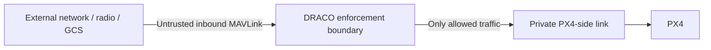

# DRACO System Architecture

**Status:** UDP gateway implemented; PX4 SITL integration in progress; IntentGuard components planned.

DRACO is an inline MAVLink reference monitor placed between an ordinary GCS/API endpoint and PX4. Its research objective is not merely to authenticate packets, but to determine whether a credential-valid command is consistent with the aircraft's committed mission intent, fresh trusted PX4 state, control context, and recent command provenance.

## Current physical data path



The current C++ implementation already provides the bidirectional UDP transport foundation. The next milestone is replacing local fake endpoints with real MAVLink traffic from PX4 SITL and then inserting semantic enforcement into that path.

## Target architecture



## Architectural principle

> DRACO never becomes the flight controller.

PX4 remains responsible for stabilization, navigation, estimator behavior, failsafes, actuator output, and flight-safety logic. DRACO performs external command mediation before selected MAVLink operations are presented to PX4.

## Main components

### UDP gateway

Implemented now in `udp_gateway.cpp`.

Responsibilities:

- maintain a GCS-facing UDP socket;
- maintain a PX4-facing UDP socket;
- use `poll()` to monitor both directions;
- forward GCS traffic toward PX4;
- forward PX4 traffic toward the known GCS endpoint; and
- provide the enforced insertion point for later MAVLink parsing and policy checks.

The current `have_gcs` flag is only routing state. It does **not** represent authentication or authorization.

### MAVLink parser and semantic classifier

This layer will convert raw frames into security-relevant operations such as:

```text
MISSION_CHANGE
PARAMETER_WRITE
POSITION_TARGET
MODE_CHANGE
COMMAND
READ_ONLY
UNKNOWN_WRITE
```

DRACO should preserve standard MAVLink 2 on both sides rather than invent a replacement command protocol.

### Fresh PX4 state cache

The state cache will hold locally observed PX4 evidence with freshness metadata, including where available:

- armed/disarmed state;
- navigation/flight mode;
- landed/airborne state;
- local/global position and velocity;
- estimator validity/health;
- failsafe state;
- mission/navigation status; and
- timestamp/age/validity for each item.

A stale value must not be interpreted as proof that a command is safe.

### Mission Intent Contract

An approved mission becomes a committed revision. The store tracks:

- revision identifier;
- parent revision;
- canonical mission hash;
- operational area / corridor;
- altitude envelope;
- permitted modes;
- mission-update policy; and
- approved parameter profile or other mission-specific constraints.



### Context-aware policy engine

The policy engine produces three outcomes:

```text
ALLOW
DENY
DEFER
```

`DEFER` exists because missing/stale evidence should not automatically become an allow decision.



### Temporal Command Interaction Window

Sensitive operations will be retained for a bounded time window so DRACO can reason about command sequences rather than isolated packets.

Example:

```text
controller-critical parameter change
        +
estimator-critical parameter change
        +
failsafe-critical parameter change
within a short interval
        ↓
combined risk predicate
```

This mechanism targets attacks in which each individual command is valid but the sequence is unsafe.

### Command Effect Contract

For selected allowed commands, DRACO records an expected consequence.



DRACO can also flag important transitions for which it observes no accepted external command, expected mission progression, or recognized PX4 internal cause.

### Evidence / provenance log

The log is intended to relate:

```text
source
+ command
+ mission revision
+ evidence snapshot
+ policy version
+ decision / reason
+ PX4 acknowledgement
+ observed outcome
```

Tamper-evident chaining can be added later, but logging alone is not the research novelty.

## Primary protected operation families

The first complete IntentGuard implementation will prioritize:

1. mission changes;
2. parameter writes; and
3. external position/setpoint commands.

These provide a focused path to demonstrate credential-valid cyber-physical misuse without attempting full MAVLink dialect coverage immediately.

## Trust and deployment boundaries



For the transparent prototype, state is initially derived from PX4 MAVLink telemetry. A hardened later variant may use a private/internal state source or PX4 integration to reduce reliance on externally visible telemetry.

The architecture assumes DRACO is on the enforced ingress path. If another network or serial path can directly reach PX4, that bypass must be closed or explicitly treated as a limitation.

## Out of core scope for the first implementation

- custom encryption or custom PKI;
- RF jamming defense;
- GNSS RF anti-spoofing;
- compromised PX4 itself;
- generic ML anomaly detection on the critical path;
- swarm/fleet coordination; and
- certification claims for real aircraft.
