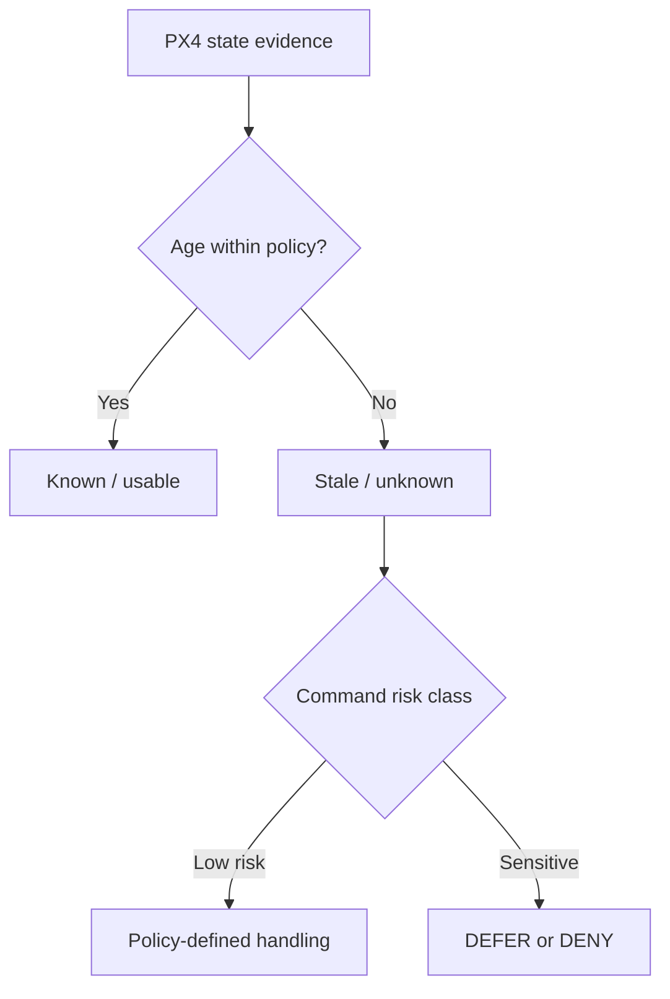

# DRACO Threat Model

**Status:** Updated for the IntentGuard research direction.

## Primary research threat

DRACO's main adversary is **not merely an unauthenticated network attacker**. The central research case is a credential-valid or otherwise authorized GCS endpoint that can send well-formed MAVLink commands whose cyber-physical meaning is unsafe for the current aircraft state or committed mission.

Examples include:

- a compromised legitimate GCS;
- stolen or misused valid credentials;
- a malicious authorized operator;
- a valid endpoint issuing unsafe mission revisions;
- a valid endpoint modifying flight-critical parameters; and
- a valid endpoint sending dangerous but syntactically correct setpoints or command sequences.

## Why this matters

Traditional communication security can answer questions such as:

```text
Who sent this packet?
Was it modified?
Is it fresh?
Is this message type allowed?
```

DRACO asks an additional question:

```text
Even if this command is valid and authenticated,
should it be allowed for THIS aircraft,
under THIS committed mission,
in THIS current state,
at THIS moment?
```

## Threat matrix

| Threat | Credential state | DRACO objective |
| --- | --- | --- |
| Passive eavesdropping | none required | Rely on established transport/link security; not core novelty |
| Packet modification / injection without valid credentials | invalid | Existing signing/secure transport should help; baseline only |
| Replay / stale network traffic | may be invalid or previously valid | Treat as supporting link-security concern |
| Stolen credential | valid | Primary target: constrain behavior to mission/state/control envelope |
| Compromised legitimate GCS | valid | Primary target |
| Malicious authorized operator | valid | Primary target |
| Unsafe mission replacement | valid | Detect mission-intent or revision conflict |
| Flight-critical parameter manipulation | valid | Evaluate parameter risk + state + temporal interaction |
| Unsafe position/setpoint request | valid | Compare target/trajectory with mission corridor and state |
| Delayed or stale state evidence | command may be valid | DENY/DEFER when evidence is too old for a safe decision |
| Compromised companion bypassing DRACO | varies | Deployment limitation unless downstream path is isolated |
| Compromised PX4 / flight controller | N/A | Out of scope for first prototype |
| Physical sensor spoofing / RF attacks | N/A | Mostly out of scope; may affect evidence quality |

## Assets and security properties

DRACO aims to protect:

- integrity of the external command path into PX4;
- consistency between accepted commands and committed mission intent;
- use of fresh, locally observed PX4 state in authorization;
- bounded handling of sensitive command sequences;
- separation between untrusted inbound traffic and the PX4-facing link;
- causal linkage between selected accepted commands and later PX4 outcomes; and
- evidence explaining why a sensitive command was allowed, denied, or deferred.

## Core trust assumptions

The first prototype assumes:

- PX4 itself is trusted;
- DRACO executes on the enforced path between external control traffic and PX4;
- the PX4-side path is not independently reachable by an attacker;
- state observed from PX4 is more trustworthy than state claimed by the GCS;
- configured mission intent and policy are themselves approved inputs;
- clocks/timestamps used for evidence age are monotonic and sufficiently reliable; and
- any existing cryptographic transport/signing mechanism is implemented correctly when used.

## Evidence model

Security decisions should distinguish **known**, **stale**, and **unknown** state.



A missing or stale position estimate must never silently become proof that a requested setpoint is safe.

## Sensitive attack classes

### Mission-intent violation

An authenticated endpoint uploads or replaces a mission that is structurally valid but inconsistent with the current committed revision or operating envelope.

### Parameter manipulation

An authenticated endpoint modifies controller-, estimator-, navigation-, failsafe-, or security-critical parameters. DRACO should consider both the individual parameter and nearby sensitive changes.

### Setpoint / offboard deviation

A valid command requests a position, trajectory, or mode inconsistent with the committed mission corridor or current state.

### Temporal command interaction

Several commands are individually acceptable but collectively dangerous because of timing, rate, ordering, or coupled effects.

### Conflicting mission revision

A controller attempts to modify an old mission revision after another valid controller has already advanced the active revision.

### Unexplained state transition

PX4 enters a security-relevant state for which DRACO has not observed an accepted command, expected mission progression, or recognized internal safety cause.

## Security decision model

```text
ALLOW  = enough fresh evidence exists and policy permits the operation
DENY   = policy positively identifies a violation
DEFER  = evidence is insufficient or stale for a safe positive authorization
```

`DEFER` is intentionally different from `DENY`: it records uncertainty rather than pretending that missing evidence proves malicious intent.

## Residual risks

Even a correct IntentGuard implementation cannot by itself guarantee safety against:

- compromised PX4 firmware;
- malicious sensors or complete sensor spoofing;
- RF jamming and communication denial;
- physical capture;
- policy misconfiguration;
- mission-intent definitions that are themselves unsafe;
- bypass paths around DRACO;
- stolen credentials used entirely within the approved mission envelope; or
- unsafe dynamics not captured by the first control/safety model.

These limitations must remain explicit in evaluation and paper claims.
